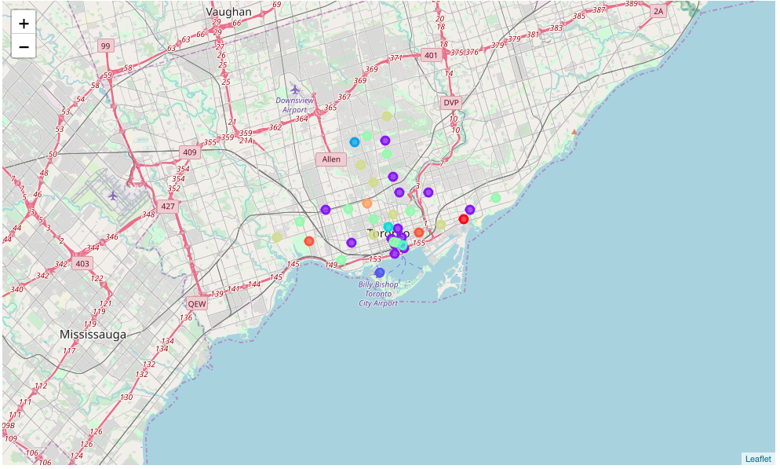
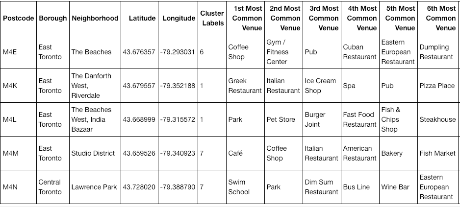

## IBM Data Science Capstone

### The Goal
- This notebook use to satisfy requirement for Applied Data Science Capstone.

### Background
In this assignment, you will be required to explore, segment, and cluster the neighborhoods in the city of Toronto. However, the neighborhood data is not readily available on the internet. What is interesting about the field of data science is that each project can be challenging in its unique way, so you need to learn to be agile and refine the skill to learn new libraries and tools quickly depending on the project.

### Segmentation and Clustering
K = 10

### Popular Venue in Toronto

